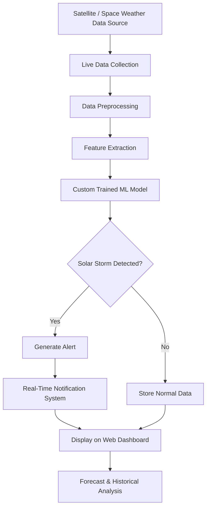

# ☀️ Solar Storm Detection & Real-Time Alert System

An AI-powered Solar Storm Monitoring System that detects solar storm activity in real time using live space weather data, machine learning models, and anomaly detection techniques. The system preprocesses incoming solar data, predicts abnormal patterns, and instantly sends alerts when potential solar storms are detected.

---

# 💡 Problem Statement

Solar storms can damage critical infrastructure and communication systems, but real-time monitoring solutions are limited and expensive. This project aims to provide an intelligent, accessible, and automated solution for detecting solar storm risks using machine learning and live data analysis.

---

# 🔥 Innovation

This project combines:
- Real-time space weather monitoring
- AI-based anomaly detection
- Machine learning forecasting
- Instant alert generation
- Live dashboard visualization

into one automated system.

---

# 🌍 Why This Project Matters

Solar storms can severely impact satellites, GPS systems, communication networks, aviation systems, and power grids. Early detection of abnormal solar activity helps organizations take preventive measures before major disruptions occur.

This project provides an AI-based real-time monitoring and alert system that can help reduce risks caused by extreme space weather events.


---

# 🏭 Real World Applications

- 🛰 Satellite protection systems
- 🌐 Communication network monitoring
- ⚡ Power grid safety management
- ✈️ Aviation and navigation systems
- 📡 Space research organizations
- ☀️ Space weather forecasting centers
- 🧠 AI-based scientific research

---

# ⚙️ Workflow Diagram



---

# 🔍 How It Works

1. The system continuously collects live solar and space weather data.
2. Incoming data is cleaned and preprocessed.
3. Important features are extracted for prediction.
4. The trained LSTM and Random Forest models analyze the data.
5. If abnormal solar activity is detected, the system triggers alerts.
6. Results are displayed on the monitoring dashboard in real time.

---

# 🛠️ Technologies Used

## Programming Languages
- Python
- PHP
- JavaScript
- HTML
- CSS

## Libraries & Tools
- TensorFlow / Keras
- Random Forest Classifier
- LSTM Model
- NumPy
- Pandas
- Matplotlib
---


# 📊 Machine Learning Models

## LSTM Model
Used for time-series forecasting and prediction of solar activity trends.

## Random Forest Classifier
Used for anomaly classification and solar storm detection.

---

# 🎥 Demo Video

[](https://youtu.be/O35QFSHDpyU?feature=shared)

---

# 📈 Output

- Real-time solar storm alerts
- Historical activity analysis
- Live monitoring dashboard

---

# ▶️ How to Run

## Clone the Repository

```bash
git clone [https://github.com/Kokila-chandrakar/Solar-Strom]
cd SolarStrom
```

## Install Dependencies

```bash
pip install -r requirements.txt
```

## Run ML Prediction

```bash
python src/ml/live_predict.py
```

## Start Web Dashboard

Run the PHP server:

```bash
php -S localhost:8000
```

Then open:

```bash
http://localhost:8000
```

---

# 🎯 Future Improvements


- Mobile application support
- Advanced deep learning models
- Improved forecasting accuracy

---

# 👨‍💻 Author


Kokila Chandrakar    
B.Tech CSE (AI & ML)   
Passionate about Full-Stack Development, AI & Cloud Computing, Software Development
